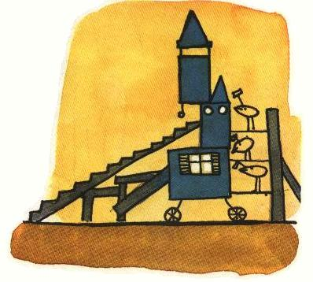

# Les raisons d'utiliser un framework CSS

## 1ère raison : DRY

_DRY_ = Don't repeat yourself.

La plupart des taches de l'intégration web sont répétitives. Un framework vous propose des **outils pour automatiser ces taches**… et peut-être éviter les erreurs d'édition manuelles fréquentes.
De plus, les solutions qu'apportent ces outils, utilisent des pratiques normalisées et courantes : pas besoin de ré-inventer l'eau chaude en somme.

## 2nde raison : La travail en équipe

Le travail au sein d'un équipe (pouvant aller jusqu'à l'international, il faut voir grand!) trouve grâce à cette méthodologie de travail une façon cohérente de collaborer. Sans compter que sur le long terme, un projet sera plus simple à faire évoluer, maintenir. Pensez à tous ces vieux projets et leurs recettes de cuisines bancales…

**Un framework populaire, mais surtout _opensource_ est aussi un creuset de savoirs partagés**. Tout ceux-ci sont construits à partir des expériences réelles des experts du métier. Sachez partager en retour.

## 3ème raison : Le prototypage

Connaître et pratiquer un framework, c'est aussi l'utiliser directement pour construire les maquettes d'un projet avec le client. Quoi de plus intéressant que de pouvoir construire une première approche d'un projet directement et de la voir fonctionner dans le navigateur.

